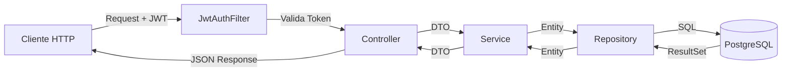
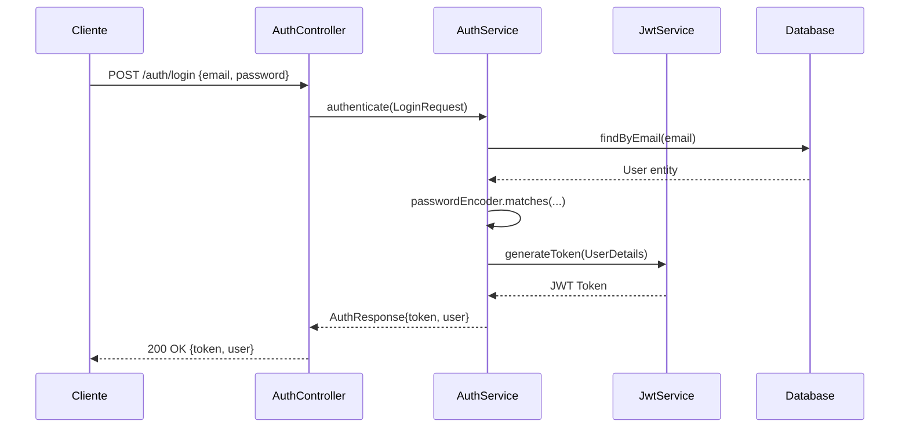

# 🍽️ MealMate Backend - API REST con Spring Boot

<div align="center">


**Planifica • Organiza • Comparte**

[](https://spring.io/projects/spring-boot)
[](https://openjdk.org/)
[](https://www.postgresql.org/)
[](https://www.docker.com/)
[](https://jwt.io/)

[Documentación](#características-principales) • [Instalación](#-instalación-y-configuración) • [API Endpoints](#-endpoints-de-la-api) • [Testing](#-testing)

</div>

---

📱 **Repositorio del Frontend**: [MealMate-Frontend](https://github.com/MealMate-Org/MealMate-Frontend)

---

## 📋 Tabla de Contenidos

- [Sobre el Proyecto](#-sobre-el-proyecto)
- [Características Principales](#-características-principales)
- [Arquitectura](#-arquitectura)
- [Stack Tecnológico](#-stack-tecnológico)
- [Requisitos Previos](#-requisitos-previos)
- [Instalación y Configuración](#-instalación-y-configuración)
- [Estructura del Proyecto](#-estructura-del-proyecto)
- [Modelo de Datos](#-modelo-de-datos)
- [Endpoints de la API](#-endpoints-de-la-api)
- [Seguridad y Autenticación](#-seguridad-y-autenticación)
- [Testing](#-testing)
- [Variables de Entorno](#-variables-de-entorno)
- [Scripts y Comandos](#-scripts-y-comandos)
- [Despliegue](#-despliegue)
- [Contribución](#-contribución)
- [Licencia](#-licencia)

---

## 🎯 Sobre el Proyecto

**MealMate Backend** es la API REST que potencia la aplicación MealMate, una plataforma web fullstack diseñada para simplificar la planificación de comidas semanales. Este backend proporciona una arquitectura robusta, escalable y segura construida con Spring Boot 3.5.6 y Java 21.

### 🌟 ¿Qué hace MealMate Backend?

MealMate es una aplicación que permite a los usuarios planificar, compartir y gestionar sus comidas semanales de forma colaborativa y personalizada. El backend combina funcionalidades de:

- **🗓️ Planificación de Menús**: Gestión completa de planes semanales con múltiples comidas diarias
- **🛒 Listas de Compra**: Generación automática de ingredientes desde el planificador
- **👥 Gestión de Usuarios**: Sistema completo con roles, preferencias y perfiles personalizables
- **📊 Control Nutricional**: Cálculo automático de macronutrientes (TMB + Factor de actividad)
- **⚠️ Alertas de Alergias**: Base de datos de alérgenos con sistema de filtrado
- **🌐 Funciones Sociales**: Favoritos, valoraciones, seguimiento entre usuarios y grupos
- **🍳 Recetas Compartidas**: Repositorio público y privado de recetas con información nutricional

El objetivo es ofrecer una API confiable, bien documentada y fácil de consumir, apta para uso personal o grupal (hogares, compañeros de piso, familias), que simplifique la organización de las comidas y fomente una alimentación más consciente.

---

## ✨ Características Principales

### 🔐 Autenticación y Autorización

```java
✅ JWT (JSON Web Tokens) para autenticación stateless
✅ BCrypt para encriptación de contraseñas
✅ Roles de usuario (ADMIN, USER)
✅ Guards personalizados con Spring Security
✅ Refresh tokens automáticos
✅ Endpoints protegidos con autorización por roles
```

### 🍳 Gestión de Recetas

```java
✅ CRUD completo de recetas
✅ Almacenamiento de ingredientes en formato JSONB
✅ Sistema de etiquetado con alérgenos
✅ Clasificación por tipo de comida (desayuno, comida, cena, aperitivo)
✅ Visibilidad pública/privada por receta
✅ Sistema de valoraciones agregadas (promedio automático)
✅ Soft delete para preservar integridad referencial
✅ Filtrado avanzado por autor, tipo y visibilidad
```

### 📅 Planificador Semanal

```java
✅ Planes semanales con fechas de inicio y fin configurables
✅ Múltiples comidas por día (3+ tipos de comida)
✅ Asociación de recetas a días específicos
✅ Cálculo automático de totales nutricionales semanales
✅ Consultas optimizadas con JPA Specifications
✅ Gestión de planes activos/inactivos
✅ Prevención de duplicados (unique constraints)
```

### 🛒 Lista de Compra

```java
✅ Generación automática desde planes semanales
✅ Almacenamiento de items en formato JSONB
✅ Estado de compra (checked/unchecked)
✅ Múltiples listas por usuario
✅ Agrupación por semana
✅ Actualización de timestamp automática
```

### 💪 Control Nutricional

```java
✅ Información nutricional por receta (calorías, proteínas, carbohidratos, grasas)
✅ Preferencias de usuario con cálculo automático de macros
✅ Fórmula de Mifflin-St Jeor (TMB)
✅ Factores de actividad (sedentario, ligero, moderado, activo, muy activo)
✅ Objetivos personalizados (déficit, mantenimiento, superávit)
✅ Validaciones de rangos nutricionales
```

### ⚠️ Sistema de Alergias

```java
✅ Catálogo completo de alérgenos comunes
✅ Relación muchos-a-muchos entre recetas y alérgenos
✅ Preferencias de alérgenos por usuario
✅ Consultas optimizadas para filtrado
```

### 👥 Funciones Sociales

```java
✅ Sistema de favoritos por usuario
✅ Valoraciones (1-5 estrellas) con cálculo de promedio
✅ Seguimiento entre usuarios (followers/following)
✅ Grupos colaborativos con roles
✅ Recetas compartidas en grupos
```

---

## 🏗️ Arquitectura

MealMate Backend sigue una **arquitectura en capas** (Layered Architecture) basada en las mejores prácticas de Spring Boot:

```
📦 MealMate Backend
│
├── 🎯 Presentation Layer (Controllers)
│   ├── REST Controllers con @RestController
│   ├── DTOs para requests/responses
│   ├── Validación de datos con Jakarta Validation
│   └── Manejo de excepciones con @RestControllerAdvice
│
├── 💼 Business Logic Layer (Services)
│   ├── Interfaces de servicio
│   ├── Implementaciones con @Service
│   ├── Lógica de negocio compleja
│   └── Orquestación de operaciones
│
├── 🗄️ Data Access Layer (Repositories)
│   ├── JpaRepository interfaces
│   ├── Custom queries con @Query
│   ├── Specifications para filtrado dinámico
│   └── Entidades JPA con Hibernate
│
├── 🛡️ Security Layer
│   ├── JWT Service (generación y validación)
│   ├── Authentication Filter
│   ├── Security Configuration
│   └── Password Encoder (BCrypt)
│
└── 🔧 Infrastructure Layer
    ├── Exception Handlers
    ├── Model Mappers (ModelMapper)
    ├── Database Migrations (SQL scripts)
    └── Docker Compose setup
```

### 📊 Flujo de Petición HTTP



### 🎯 Patrones de Diseño Implementados

| Patrón | Implementación | Beneficio |
|--------|----------------|-----------|
| **Repository Pattern** | JpaRepository | Abstracción de acceso a datos |
| **Service Layer** | @Service | Encapsulación de lógica de negocio |
| **DTO Pattern** | DTOs separados de Entities | Desacoplamiento y control de datos expuestos |
| **Dependency Injection** | @Autowired, Constructor Injection | Bajo acoplamiento, alta cohesión |
| **Builder Pattern** | Lombok @Builder | Construcción fluida de objetos |
| **Singleton** | Spring Beans | Una instancia por contexto |
| **Strategy Pattern** | Interfaces de servicio | Intercambiabilidad de implementaciones |
| **Template Method** | JpaRepository | Código reutilizable |

---

## 🛠️ Stack Tecnológico

### Core Framework

| Tecnología | Versión | Propósito |
|-----------|---------|-----------|
| **Spring Boot** | 3.5.6 | Framework principal |
| **Java** | 21 (LTS) | Lenguaje de programación |
| **Maven** | 3.9+ | Gestión de dependencias |

### Persistencia y Base de Datos

| Tecnología | Versión | Propósito |
|-----------|---------|-----------|
| **Spring Data JPA** | 3.5.6 | ORM y acceso a datos |
| **Hibernate** | 6.6.4 | Implementación JPA |
| **PostgreSQL** | 16-alpine | Base de datos relacional |
| **Docker Compose** | 3.8 | Orquestación de contenedores |
| **Flyway** | - | Migraciones de BD (potencial) |

### Seguridad

| Tecnología | Versión | Propósito |
|-----------|---------|-----------|
| **Spring Security** | 6.4.2 | Framework de seguridad |
| **JWT (jjwt)** | 0.11.5 | Tokens de autenticación |
| **BCrypt** | Built-in | Hash de contraseñas |

### Utilidades

| Tecnología | Versión | Propósito |
|-----------|---------|-----------|
| **Lombok** | 1.18.36 | Reducción de boilerplate |
| **ModelMapper** | 3.1.1 | Mapeo Entity ↔ DTO |
| **Jackson** | 2.18.2 | Serialización JSON |
| **Hibernate Types** | Built-in | Soporte JSONB |

### Testing

| Tecnología | Versión | Propósito |
|-----------|---------|-----------|
| **JUnit 5** | 5.11.4 | Framework de testing |
| **Mockito** | 5.14.2 | Mocking |
| **AssertJ** | 3.27.3 | Assertions fluidas |
| **Spring Boot Test** | 3.5.6 | Testing de integración |
| **H2 Database** | 2.3.232 | BD en memoria para tests |
| **JaCoCo** | 0.8.11 | Cobertura de código |

### DevOps

| Tecnología | Versión | Propósito |
|-----------|---------|-----------|
| **Spring Boot DevTools** | 3.5.6 | Live reload |
| **Spring Boot Docker Compose** | 3.5.6 | Integración Docker |

---

## 📋 Requisitos Previos

Antes de comenzar, asegúrate de tener instalado:

| Software | Versión Mínima | Comando de Verificación |
|----------|----------------|-------------------------|
| **Java JDK** | 21 (LTS) | `java -version` |
| **Maven** | 3.9+ | `mvn -version` |
| **Docker** | 20.x+ | `docker --version` |
| **Docker Compose** | 2.x+ | `docker compose version` |
| **PostgreSQL Client** | 16+ (opcional) | `psql --version` |
| **Git** | Cualquiera | `git --version` |

### Instalación de Java 21 (si no lo tienes)

**macOS/Linux (con SDKMAN)**
```bash
curl -s "https://get.sdkman.io" | bash
sdk install java 21-open
```

**Windows**
- Descarga desde [Adoptium](https://adoptium.net/) o [Oracle](https://www.oracle.com/java/technologies/downloads/)
- Configura `JAVA_HOME` en las variables de entorno

---

## 🚀 Instalación y Configuración

### 1️⃣ Clonar el Repositorio

```bash
git clone https://github.com/MealMate-Org/MealMate-Backend.git
cd MealMate-Backend
```

### 2️⃣ Configurar Variables de Entorno

Crea un archivo `.env` en la raíz del proyecto (o usa las variables por defecto):

```bash
# Database Configuration
POSTGRES_DB=mealmate
POSTGRES_USER=postgres
POSTGRES_PASSWORD=postgres
POSTGRES_PORT=5432
```

**Nota**: El archivo `.env` ya está configurado en el proyecto. Si necesitas cambiar las credenciales, modifícalo según tus necesidades.

### 3️⃣ Levantar la Base de Datos con Docker

```bash
docker compose up -d
```

Este comando:
- ✅ Descarga la imagen de PostgreSQL 16 Alpine
- ✅ Crea el contenedor `mealmate-postgres`
- ✅ Expone el puerto 5432
- ✅ Crea un volumen persistente `postgres_data`
- ✅ Ejecuta los scripts de inicialización:
  - `reset-database.sql` (limpia BD si existe)
  - `schema.sql` (crea todas las tablas)
  - `data-bcrypt.sql` (inserta datos de ejemplo)

**Verificar que la BD está corriendo:**
```bash
docker compose ps
```

Deberías ver:
```
NAME                  STATUS    PORTS
mealmate-postgres    Up        0.0.0.0:5432->5432/tcp
```

### 4️⃣ Instalar Dependencias Maven

```bash
mvn clean install
```

Este comando:
- Descarga todas las dependencias del `pom.xml`
- Compila el proyecto
- Ejecuta los tests (puedes saltar con `-DskipTests`)

### 5️⃣ Ejecutar la Aplicación

**Opción A: Con Maven**
```bash
mvn spring-boot:run
```

**Opción B: Con JAR compilado**
```bash
mvn clean package -DskipTests
java -jar target/MealMateBackend-0.0.1-SNAPSHOT.jar
```

**Opción C: Desde tu IDE**
- Abre el proyecto en IntelliJ IDEA / Eclipse / VS Code
- Ejecuta `MealMateBackendApplication.java`

La aplicación estará disponible en `http://localhost:8080`

### 6️⃣ Verificar que Funciona

**Health Check:**
```bash
curl http://localhost:8080/api/v1/recipes
```

Deberías ver un JSON con las recetas públicas.

**Login de prueba:**
```bash
curl -X POST http://localhost:8080/api/v1/auth/login \
  -H "Content-Type: application/json" \
  -d '{
    "email": "admin@mealmate.com",
    "password": "password"
  }'
```

Deberías recibir un token JWT y datos del usuario.

---

## 📁 Estructura del Proyecto

```
MealMateBackend/
│
├── 📂 src/
│   ├── 📂 main/
│   │   ├── 📂 java/com/MealMate/MealMateBackend/
│   │   │   │
│   │   │   ├── 📂 auth/                    # Autenticación
│   │   │   │   ├── controller/
│   │   │   │   │   └── AuthController.java
│   │   │   │   ├── dto/
│   │   │   │   │   ├── AuthResponse.java
│   │   │   │   │   ├── LoginRequest.java
│   │   │   │   │   └── RegisterRequest.java
│   │   │   │   └── service/
│   │   │   │       └── AuthService.java
│   │   │   │
│   │   │   ├── 📂 config/                  # Configuración
│   │   │   │   └── SecurityConfig.java
│   │   │   │
│   │   │   ├── 📂 exception/               # Manejo de excepciones
│   │   │   │   └── GlobalExceptionHandler.java
│   │   │   │
│   │   │   ├── 📂 nutrition/               # Información nutricional
│   │   │   │   ├── controller/
│   │   │   │   ├── dto/
│   │   │   │   ├── model/
│   │   │   │   ├── repository/
│   │   │   │   └── service/
│   │   │   │
│   │   │   ├── 📂 planner/                 # Planificador
│   │   │   │   ├── controller/
│   │   │   │   │   ├── MealPlanController.java
│   │   │   │   │   ├── MealPlanItemController.java
│   │   │   │   │   └── MealTypeController.java
│   │   │   │   ├── dto/
│   │   │   │   ├── model/
│   │   │   │   │   ├── MealPlan.java
│   │   │   │   │   ├── MealPlanItem.java
│   │   │   │   │   └── MealType.java
│   │   │   │   ├── repository/
│   │   │   │   └── service/
│   │   │   │
│   │   │   ├── 📂 rating/                  # Valoraciones y favoritos
│   │   │   │   ├── controller/
│   │   │   │   ├── dto/
│   │   │   │   ├── model/
│   │   │   │   ├── repository/
│   │   │   │   └── service/
│   │   │   │
│   │   │   ├── 📂 recipe/                  # Recetas
│   │   │   │   ├── controller/
│   │   │   │   │   ├── RecipeController.java
│   │   │   │   │   └── AllergenController.java
│   │   │   │   ├── dto/
│   │   │   │   │   ├── RecipeDTO.java
│   │   │   │   │   ├── RecipeCreateDTO.java
│   │   │   │   │   ├── AllergenDTO.java
│   │   │   │   │   └── IngredientItem.java
│   │   │   │   ├── model/
│   │   │   │   │   ├── Recipe.java
│   │   │   │   │   ├── Allergen.java
│   │   │   │   │   └── IngredientItem.java
│   │   │   │   ├── repository/
│   │   │   │   └── service/
│   │   │   │
│   │   │   ├── 📂 security/                # Seguridad JWT
│   │   │   │   ├── CustomUserDetailsService.java
│   │   │   │   ├── JwtAuthenticationFilter.java
│   │   │   │   └── JwtService.java
│   │   │   │
│   │   │   ├── 📂 shopping/                # Listas de compra
│   │   │   │   ├── controller/
│   │   │   │   ├── dto/
│   │   │   │   ├── model/
│   │   │   │   ├── repository/
│   │   │   │   └── service/
│   │   │   │
│   │   │   ├── 📂 social/                  # Funciones sociales
│   │   │   │   ├── controller/
│   │   │   │   │   ├── GroupController.java
│   │   │   │   │   ├── FollowController.java
│   │   │   │   │   └── GroupRecipeController.java
│   │   │   │   ├── dto/
│   │   │   │   ├── model/
│   │   │   │   ├── repository/
│   │   │   │   └── service/
│   │   │   │
│   │   │   ├── 📂 user/                    # Usuarios
│   │   │   │   ├── controller/
│   │   │   │   │   ├── UserController.java
│   │   │   │   │   ├── UserPreferenceController.java
│   │   │   │   │   ├── UserAllergenController.java
│   │   │   │   │   └── DietController.java
│   │   │   │   ├── dto/
│   │   │   │   ├── model/
│   │   │   │   │   ├── User.java
│   │   │   │   │   ├── Role.java
│   │   │   │   │   ├── UserPreference.java
│   │   │   │   │   ├── Diet.java
│   │   │   │   │   └── UserAllergen.java
│   │   │   │   ├── repository/
│   │   │   │   └── service/
│   │   │   │
│   │   │   └── MealMateBackendApplication.java
│   │   │
│   │   └── 📂 resources/
│   │       └── application.properties
│   │
│   └── 📂 test/
│       └── 📂 java/com/MealMate/MealMateBackend/
│           ├── 📂 nutrition/service/
│           │   └── NutritionInfoServiceImplTest.java
│           ├── 📂 planner/service/
│           │   ├── MealPlanServiceImplTest.java
│           │   ├── MealPlanItemServiceImplTest.java
│           │   └── MealTypeServiceImplTest.java
│           ├── 📂 rating/service/
│           │   ├── FavoriteServiceImplTest.java
│           │   └── RatingServiceImplTest.java
│           ├── 📂 recipe/service/
│           │   ├── RecipeServiceImplTest.java
│           │   └── AllergenServiceImplTest.java
│           ├── 📂 shopping/service/
│           │   └── ShoppingListServiceImplTest.java
│           └── 📂 user/service/
│               ├── UserServiceImplTest.java
│               └── UserPreferenceServiceImplTest.java
│
├── 📂 target/                              # Archivos compilados
├── .env                                    # Variables de entorno
├── .gitignore                              # Archivos ignorados por Git
├── compose.yaml                            # Docker Compose
├── data-bcrypt.sql                         # Datos de ejemplo
├── schema.sql                              # Esquema de BD
├── reset-database.sql                      # Limpieza de BD
├── pom.xml                                 # Configuración Maven
└── README.md                               # Este archivo
```

---

## 🗄️ Modelo de Datos

### Diagrama Entidad-Relación (Simplificado)

```
┌─────────────┐       ┌──────────────┐       ┌─────────────┐
│    users    │──────▶│user_preferences│     │   recipes   │
│   (1:1)     │       │                │     │             │
└─────────────┘       └──────────────┘       └─────────────┘
       │                      │                      │
       │                      │                      │
       ▼                      ▼                      ▼
┌─────────────┐       ┌──────────────┐       ┌─────────────┐
│ meal_plans  │──────▶│meal_plan_items│◀──────│ nutrition_info│
│             │       │   (N:M)       │       │   (1:1)     │
└─────────────┘       └──────────────┘       └─────────────┘
       │                                            │
       │                                            │
       ▼                                            ▼
┌─────────────┐                             ┌─────────────┐
│shopping_lists│                            │   ratings   │
│             │                              │  (N:M)      │
└─────────────┘                             └─────────────┘
```

### Tablas Principales

| Tabla | Descripción | Campos Clave |
|-------|-------------|--------------|
| **users** | Usuarios del sistema | id, username, email, password (BCrypt), role_id |
| **recipes** | Recetas de cocina | id, title, instructions, ingredients (JSONB), author_id, is_public |
| **meal_plans** | Planes semanales | id, user_id, start_date, end_date, is_active |
| **meal_plan_items** | Items de un plan | id, meal_plan_id, recipe_id, meal_type_id, date |
| **nutrition_info** | Info nutricional | recipe_id (PK), calories, protein, carbs, fat |
| **shopping_lists** | Listas de compra | id, user_id, items (JSONB), week_start_date |
| **ratings** | Valoraciones | (user_id, recipe_id) PK, score (1-5) |
| **favorites** | Favoritos | (user_id, recipe_id) PK |
| **allergens** | Alérgenos | id, name |
| **user_allergens** | Alérgenos del usuario | user_id, allergen_id |

### Tipos de Datos Especiales

**JSONB en PostgreSQL:**
- `recipes.ingredients`: Array de objetos `{name, quantity, unit}`
- `shopping_lists.items`: Array de objetos `{name, quantity, unit, checked}`

**Ejemplo de ingredientes JSONB:**
```json
[
  {"name": "harina", "quantity": 200.0, "unit": "g"},
  {"name": "huevos", "quantity": 2.0, "unit": "unidades"},
  {"name": "leche", "quantity": 250.0, "unit": "ml"}
]
```

---

## 🔌 Endpoints de la API

### Base URL
```
http://localhost:8080/api/v1
```

### 🔐 Authentication

| Método | Endpoint | Descripción | Auth |
|--------|----------|-------------|------|
| POST | `/auth/login` | Iniciar sesión | ❌ |
| POST | `/auth/register` | Registrar usuario | ❌ |

**Login Request:**
```json
POST /api/v1/auth/login
{
  "email": "usuario@ejemplo.com",
  "password": "micontraseña"
}
```

**Response:**
```json
{
  "token": "eyJhbGciOiJIUzI1NiIsInR5cCI6IkpXVCJ9...",
  "user": {
    "id": 1,
    "username": "usuario1",
    "email": "usuario@ejemplo.com",
    "roleId": 2
  }
}
```

### 👤 Users

| Método | Endpoint | Descripción | Auth |
|--------|----------|-------------|------|
| GET | `/users` | Listar usuarios | ✅ |
| GET | `/users/{id}` | Obtener usuario | ✅ |
| PUT | `/users/{id}` | Actualizar usuario | ✅ |
| DELETE | `/users/{id}` | Eliminar usuario | ✅ |

### 💪 User Preferences

| Método | Endpoint | Descripción | Auth |
|--------|----------|-------------|------|
| GET | `/user-preferences/{userId}` | Obtener preferencias | ✅ |
| POST | `/user-preferences` | Crear/actualizar preferencias | ✅ |
| DELETE | `/user-preferences/{userId}` | Eliminar preferencias | ✅ |

**Ejemplo de preferencias con cálculo automático:**
```json
POST /api/v1/user-preferences
{
  "userId": 1,
  "useAutomaticCalculation": true,
  "gender": "male",
  "age": 30,
  "weight": 75.0,
  "height": 175.0,
  "activityLevel": "moderate",
  "goal": "maintenance",
  "dietId": 1
}
```

### 🍳 Recipes

| Método | Endpoint | Descripción | Auth |
|--------|----------|-------------|------|
| GET | `/recipes` | Listar recetas públicas | ❌ |
| GET | `/recipes?authorId={id}` | Recetas de un autor | ❌/✅ |
| GET | `/recipes/{id}` | Detalle de receta | ❌/✅ |
| POST | `/recipes` | Crear receta | ✅ |
| PUT | `/recipes/{id}` | Actualizar receta | ✅ |
| DELETE | `/recipes/{id}` | Eliminar receta | ✅ |

**Crear receta:**
```json
POST /api/v1/recipes
{
  "title": "Tortilla Española",
  "description": "Receta tradicional",
  "instructions": "1. Pelar patatas...\n2. Freír...",
  "imagePath": "https://ejemplo.com/imagen.jpg",
  "authorId": 1,
  "isPublic": true,
  "mealTypeId": 2,
  "ingredients": [
    {"name": "patatas", "quantity": 4.0, "unit": "unidades"},
    {"name": "huevos", "quantity": 6.0, "unit": "unidades"}
  ],
  "allergenIds": [6]
}
```

### ⚠️ Allergens

| Método | Endpoint | Descripción | Auth |
|--------|----------|-------------|------|
| GET | `/allergens` | Listar alérgenos | ❌ |
| GET | `/user-allergens/{userId}` | Alérgenos del usuario | ✅ |
| POST | `/user-allergens/{userId}` | Guardar alérgenos | ✅ |

### 📊 Nutrition Info

| Método | Endpoint | Descripción | Auth |
|--------|----------|-------------|------|
| GET | `/nutrition-info/{recipeId}` | Info nutricional | ❌ |
| POST | `/nutrition-info` | Crear/actualizar info | ✅ |
| DELETE | `/nutrition-info/{recipeId}` | Eliminar info | ✅ |

### 📅 Meal Plans

| Método | Endpoint | Descripción | Auth |
|--------|----------|-------------|------|
| GET | `/meal-plans` | Listar planes | ✅ |
| GET | `/meal-plans/{id}` | Detalle de plan | ✅ |
| GET | `/meal-plans/user/{userId}` | Planes de usuario | ✅ |
| GET | `/meal-plans/user/{userId}/week?weekStart=...&weekEnd=...` | Plan de semana específica (o crear si no existe) | ✅ |
| POST | `/meal-plans` | Crear plan | ✅ |
| PUT | `/meal-plans/{id}` | Actualizar plan | ✅ |
| DELETE | `/meal-plans/{id}` | Eliminar plan | ✅ |

### 🍽️ Meal Plan Items

| Método | Endpoint | Descripción | Auth |
|--------|----------|-------------|------|
| GET | `/meal-plan-items` | Listar items | ✅ |
| GET | `/meal-plan-items/{id}` | Detalle de item | ✅ |
| GET | `/meal-plan-items/meal-plan/{id}` | Items de un plan | ✅ |
| GET | `/meal-plan-items/user/{userId}/date-range?startDate=...&endDate=...` | Items de usuario en rango | ✅ |
| POST | `/meal-plan-items` | Crear item | ✅ |
| POST | `/meal-plan-items/batch` | Crear múltiples items | ✅ |
| PUT | `/meal-plan-items/{id}` | Actualizar item | ✅ |
| DELETE | `/meal-plan-items/{id}` | Eliminar item | ✅ |

### 🛒 Shopping Lists

| Método | Endpoint | Descripción | Auth |
|--------|----------|-------------|------|
| GET | `/shopping-lists` | Listar listas | ✅ |
| GET | `/shopping-lists/{id}` | Detalle de lista | ✅ |
| GET | `/shopping-lists/user/{userId}` | Listas de usuario | ✅ |
| POST | `/shopping-lists` | Crear lista | ✅ |
| PUT | `/shopping-lists/{id}` | Actualizar lista | ✅ |
| DELETE | `/shopping-lists/{id}` | Eliminar lista | ✅ |

### ⭐ Ratings & Favorites

| Método | Endpoint | Descripción | Auth |
|--------|----------|-------------|------|
| GET | `/ratings` | Listar valoraciones | ✅ |
| GET | `/ratings/{recipeId}/{userId}` | Valoración específica | ✅ |
| POST | `/ratings` | Crear/actualizar valoración | ✅ |
| DELETE | `/ratings/{recipeId}/{userId}` | Eliminar valoración | ✅ |
| GET | `/favorites` | Mis favoritos | ✅ |
| POST | `/favorites` | Añadir favorito | ✅ |
| DELETE | `/favorites/{userId}/{recipeId}` | Quitar favorito | ✅ |

### 👥 Social (Groups & Follows)

| Método | Endpoint | Descripción | Auth |
|--------|----------|-------------|------|
| GET | `/groups` | Listar grupos | ✅ |
| POST | `/groups` | Crear grupo | ✅ |
| GET | `/follows` | Listar seguimientos | ✅ |
| POST | `/follows` | Seguir usuario | ✅ |

---

## 🔐 Seguridad y Autenticación

### JWT (JSON Web Tokens)

MealMate usa JWT para autenticación stateless:

```java
// Estructura del token
{
  "sub": "usuario@ejemplo.com",    // Email del usuario
  "iat": 1701234567,                 // Timestamp de emisión
  "exp": 1701320967                  // Timestamp de expiración (24h)
}
```

### Flujo de Autenticación



### Protección de Endpoints

```java
// SecurityConfig.java
.authorizeHttpRequests(auth -> auth
    .requestMatchers("/api/v1/auth/**").permitAll()
    .requestMatchers(HttpMethod.GET, "/api/v1/recipes/**").permitAll()
    .anyRequest().authenticated()
)
```

### Password Hashing

Todas las contraseñas se hashean con **BCrypt** (factor de coste 10):

```java
// Ejemplo de hash BCrypt
$2a$10$92IXUNpkjO0rOQ5byMi.Ye4oKoEa3Ro9llC/.og/at2.uheWG/igi
```

### CORS Configuration

El backend permite peticiones desde el frontend:

```java
.setAllowedOrigins(Arrays.asList("http://localhost:4200"))
.setAllowedMethods(Arrays.asList("GET", "POST", "PUT", "DELETE", "OPTIONS"))
.setAllowedHeaders(Arrays.asList("*"))
.setAllowCredentials(true)
```

---

## 🧪 Testing

MealMate tiene una cobertura de tests completa para garantizar la calidad del código.

### Ejecutar Todos los Tests

```bash
mvn test
```

### Ejecutar Tests con Cobertura (JaCoCo)

```bash
mvn clean test jacoco:report
```

El reporte HTML se genera en: `target/site/jacoco/index.html`

### Estadísticas de Testing

| Módulo | Tests | Cobertura |
|--------|-------|-----------|
| **Nutrition** | 12 tests | ~90% |
| **Planner** | 28 tests | ~85% |
| **Rating** | 16 tests | ~88% |
| **Recipe** | 24 tests | ~87% |
| **Shopping** | 14 tests | ~86% |
| **User** | 18 tests | ~89% |
| **Total** | **112+ tests** | **~87%** |

### Tecnologías de Testing

```java
@ExtendWith(MockitoExtension.class)  // Mockito para mocking
class RecipeServiceImplTest {
    
    @Mock
    private RecipeRepository recipeRepository;
    
    @InjectMocks
    private RecipeServiceImpl recipeService;
    
    @Test
    void createRecipe_ShouldCreateRecipe() {
        // Arrange
        when(recipeRepository.save(any())).thenReturn(recipe);
        
        // Act
        RecipeDTO result = recipeService.createRecipe(createDTO);
        
        // Assert
        assertThat(result).isNotNull();
        assertThat(result.getTitle()).isEqualTo("Test Recipe");
    }
}
```

### Ejemplos de Tests

**Test de Servicio (Unit):**
```java
@Test
void getNutritionInfoByRecipeId_ShouldReturnNutritionInfo_WhenExists() {
    // Given
    when(nutritionInfoRepository.findById(1L)).thenReturn(Optional.of(nutritionInfo));
    when(modelMapper.map(nutritionInfo, NutritionInfoDTO.class)).thenReturn(nutritionInfoDTO);

    // When
    NutritionInfoDTO result = nutritionInfoService.getNutritionInfoByRecipeId(1L);

    // Then
    assertThat(result).isNotNull();
    assertThat(result.getCalories()).isEqualByComparingTo(new BigDecimal("500.00"));
    verify(nutritionInfoRepository, times(1)).findById(1L);
}
```

**Test de Controlador (Integration):**
```java
@Test
@WithMockUser
void getAllRecipes_ShouldReturnAllRecipes() throws Exception {
    when(recipeService.getPublicRecipes()).thenReturn(Arrays.asList(recipeDTO));

    mockMvc.perform(get("/api/v1/recipes"))
            .andExpect(status().isOk())
            .andExpect(jsonPath("$[0].title").value("Test Recipe"));
}
```

### Base de Datos H2 para Tests

Los tests usan una base de datos H2 en memoria:

```properties
# application-test.properties
spring.datasource.url=jdbc:h2:mem:testdb
spring.jpa.hibernate.ddl-auto=create-drop
```

---

## 🌍 Variables de Entorno

### Archivo .env

```bash
# Database Configuration
POSTGRES_DB=mealmate
POSTGRES_USER=postgres
POSTGRES_PASSWORD=postgres
POSTGRES_PORT=5432
```

### application.properties

```properties
# === DATASOURCE ===
spring.datasource.url=jdbc:postgresql://localhost:5432/mealmate
spring.datasource.username=postgres
spring.datasource.password=postgres
spring.datasource.driver-class-name=org.postgresql.Driver

# === JPA ===
spring.jpa.hibernate.ddl-auto=none
spring.jpa.show-sql=true
spring.jpa.properties.hibernate.format_sql=true
spring.jpa.properties.hibernate.dialect=org.hibernate.dialect.PostgreSQLDialect

# === SERVER ===
server.port=8080

# === LOGGING ===
logging.level.org.hibernate.SQL=DEBUG
logging.level.com.MealMate.MealMateBackend=DEBUG

# === CORS ===
spring.web.cors.allowed-origins=http://localhost:4200
```

### Variables de Producción (Ejemplo)

```properties
# application-prod.properties
spring.datasource.url=${DATABASE_URL}
spring.datasource.username=${DATABASE_USER}
spring.datasource.password=${DATABASE_PASSWORD}
spring.jpa.show-sql=false
logging.level.com.MealMate.MealMateBackend=INFO
```

---

## 📜 Scripts y Comandos

### Maven Commands

| Comando | Descripción |
|---------|-------------|
| `mvn clean` | Limpia el directorio target |
| `mvn compile` | Compila el código fuente |
| `mvn test` | Ejecuta los tests |
| `mvn package` | Genera el JAR |
| `mvn install` | Instala en repo local |
| `mvn spring-boot:run` | Ejecuta la aplicación |
| `mvn clean package -DskipTests` | Build sin tests |
| `mvn jacoco:report` | Genera reporte de cobertura |

### Docker Commands

| Comando | Descripción |
|---------|-------------|
| `docker compose up -d` | Levanta PostgreSQL en background |
| `docker compose down` | Detiene y elimina contenedores |
| `docker compose ps` | Estado de contenedores |
| `docker compose logs -f` | Ver logs en tiempo real |
| `docker compose exec postgres psql -U postgres -d mealmate` | Acceder a PostgreSQL |

### PostgreSQL Commands

```bash
# Conectar a la base de datos
docker compose exec postgres psql -U postgres -d mealmate

# Listar tablas
\dt

# Ver estructura de una tabla
\d recipes

# Ejecutar consulta
SELECT * FROM users;

# Salir
\q
```

---

## 🚢 Despliegue

### Opción 1: Heroku

**Requisitos:**
- Cuenta de Heroku
- Heroku CLI instalado

```bash
# Login
heroku login

# Crear app
heroku create mealmate-backend

# Añadir PostgreSQL
heroku addons:create heroku-postgresql:hobby-dev

# Deploy
git push heroku main

# Ver logs
heroku logs --tail
```

**Configuración de variables:**
```bash
heroku config:set JAVA_OPTS="-Xmx512m"
heroku config:set SPRING_PROFILES_ACTIVE=prod
```

### Opción 2: Railway

1. Conecta tu repositorio GitHub en [railway.app](https://railway.app)
2. Añade una base de datos PostgreSQL
3. Configura las variables de entorno automáticamente
4. Deploy con un clic

### Opción 3: Docker (Producción)

**Dockerfile:**
```dockerfile
FROM maven:3.9-eclipse-temurin-21 AS build
WORKDIR /app
COPY pom.xml .
COPY src ./src
RUN mvn clean package -DskipTests

FROM eclipse-temurin:21-jre-alpine
WORKDIR /app
COPY --from=build /app/target/*.jar app.jar
EXPOSE 8080
ENTRYPOINT ["java", "-jar", "app.jar"]
```

**Build y Run:**
```bash
# Build image
docker build -t mealmate-backend .

# Run container
docker run -p 8080:8080 \
  -e DATABASE_URL=jdbc:postgresql://host:5432/mealmate \
  -e DATABASE_USER=postgres \
  -e DATABASE_PASSWORD=password \
  mealmate-backend
```

### Opción 4: AWS EC2

1. Lanza una instancia EC2 (Ubuntu 22.04)
2. Instala Java 21 y PostgreSQL
3. Copia el JAR al servidor
4. Ejecuta con `nohup` o crea un servicio `systemd`

```bash
# Crear servicio systemd
sudo nano /etc/systemd/system/mealmate.service

[Unit]
Description=MealMate Backend
After=network.target

[Service]
User=ubuntu
WorkingDirectory=/home/ubuntu/mealmate
ExecStart=/usr/bin/java -jar MealMateBackend-0.0.1-SNAPSHOT.jar
Restart=always

[Install]
WantedBy=multi-user.target

# Iniciar servicio
sudo systemctl enable mealmate
sudo systemctl start mealmate
```

### Checklist de Producción

```
✅ Cambiar credenciales de base de datos
✅ Configurar HTTPS/SSL
✅ Establecer SPRING_PROFILES_ACTIVE=prod
✅ Deshabilitar actualizaciones automáticas de esquema (ddl-auto=none)
✅ Configurar logging apropiado
✅ Añadir health checks
✅ Configurar backups de BD
✅ Establecer límites de rate limiting
✅ Configurar CORS para dominio de producción
✅ Cambiar SECRET_KEY del JWT
```

---

## 🔧 Solución de Problemas

### Error: "Port 8080 is already in use"

```bash
# Matar proceso en puerto 8080 (Linux/Mac)
lsof -ti:8080 | xargs kill -9

# Windows
netstat -ano | findstr :8080
taskkill /PID <PID> /F
```

### Error: "Cannot connect to database"

```bash
# Verificar que Docker está corriendo
docker compose ps

# Reiniciar contenedor
docker compose restart

# Ver logs
docker compose logs postgres
```

### Error: "Invalid JWT token"

- Verifica que el token no haya expirado (24h)
- Asegúrate de enviar el header: `Authorization: Bearer <token>`
- Comprueba que el `SECRET_KEY` no haya cambiado

### Error: "Circular dependency"

Si encuentras dependencias circulares entre servicios, usa `@Lazy` o refactoriza:

```java
@Autowired
public RecipeService(@Lazy UserService userService) {
    this.userService = userService;
}
```

### Error: "Failed to configure a DataSource"

Asegúrate de que:
1. PostgreSQL está corriendo
2. Las credenciales en `.env` son correctas
3. El puerto 5432 no está bloqueado

---

## 🤝 Contribución

¡Las contribuciones son bienvenidas! Sigue estos pasos:

### 1. Fork del Proyecto

Haz clic en "Fork" en la parte superior del repositorio.

### 2. Clonar tu Fork

```bash
git clone https://github.com/tu-usuario/MealMate-Backend.git
cd MealMate-Backend
```

### 3. Crear una Rama

```bash
git checkout -b feature/nueva-funcionalidad
```

### 4. Realizar Cambios

- Escribe código limpio y bien documentado
- Añade tests para nueva funcionalidad
- Sigue las convenciones de Spring Boot
- Usa Javadoc para métodos públicos

### 5. Ejecutar Tests

```bash
mvn clean test
```

Asegúrate de que todos los tests pasen.

### 6. Commit

```bash
git add .
git commit -m "feat: añadir endpoint de estadísticas nutricionales"
```

Usa [Conventional Commits](https://www.conventionalcommits.org/):
- `feat:` Nueva funcionalidad
- `fix:` Corrección de bugs
- `docs:` Documentación
- `refactor:` Refactorización
- `test:` Tests
- `chore:` Mantenimiento

### 7. Push

```bash
git push origin feature/nueva-funcionalidad
```

### 8. Pull Request

Abre un Pull Request en GitHub describiendo:
- ✅ Qué cambios realizaste
- ✅ Por qué son necesarios
- ✅ Cómo probar los cambios
- ✅ Screenshots (si aplica)

---

## 📝 Roadmap

### En Desarrollo

- [ ] Integración de Swagger/OpenAPI para documentación automática
- [ ] Websockets para actualización en tiempo real
- [ ] Sistema de notificaciones por email
- [ ] Exportación de planes a PDF
- [ ] API de terceros para información nutricional automática

### Futuro

- [ ] Soporte multiidioma (i18n)
- [ ] Integración con aplicaciones de fitness
- [ ] Machine Learning para recomendaciones personalizadas
- [ ] Modo offline con sincronización
- [ ] Aplicación móvil nativa

---

## 📄 Licencia

Este proyecto está bajo la Licencia MIT. Ver el archivo `LICENSE` para más detalles.

```
MIT License

Copyright (c) 2025 MealMate

Permission is hereby granted, free of charge, to any person obtaining a copy
of this software and associated documentation files (the "Software"), to deal
in the Software without restriction, including without limitation the rights
to use, copy, modify, merge, publish, distribute, sublicense, and/or sell
copies of the Software, and to permit persons to whom the Software is
furnished to do so, subject to the following conditions:

The above copyright notice and this permission notice shall be included in all
copies or substantial portions of the Software.

THE SOFTWARE IS PROVIDED "AS IS", WITHOUT WARRANTY OF ANY KIND, EXPRESS OR
IMPLIED, INCLUDING BUT NOT LIMITED TO THE WARRANTIES OF MERCHANTABILITY,
FITNESS FOR A PARTICULAR PURPOSE AND NONINFRINGEMENT. IN NO EVENT SHALL THE
AUTHORS OR COPYRIGHT HOLDERS BE LIABLE FOR ANY CLAIM, DAMAGES OR OTHER
LIABILITY, WHETHER IN AN ACTION OF CONTRACT, TORT OR OTHERWISE, ARISING FROM,
OUT OF OR IN CONNECTION WITH THE SOFTWARE OR THE USE OR OTHER DEALINGS IN THE
SOFTWARE.
```

---

## 👥 Autores

- **Miguel Ballesteros** - [@miguelbac](https://github.com/miguelbac)

---

## 📞 Contacto y Soporte

¿Tienes preguntas o sugerencias? ¡Contáctanos!

- 📧 Email: [miguel.ba.caballero@gmail.com](mailto:miguel.ba.caballero@gmail.com)
- 🐛 Issues: [GitHub Issues](https://github.com/MealMate-Org/MealMate-Backend/issues)
- 💬 Discussions: [GitHub Discussions](https://github.com/MealMate-Org/MealMate-Backend/discussions)

---

<div align="center">

**⭐ Si te gusta este proyecto, dale una estrella en GitHub ⭐**

**🍽️ ¡Happy Coding y Buen Provecho! 🍽️**

[⬆ Volver arriba](#️-mealmate-backend---api-rest-con-spring-boot)

</div>
